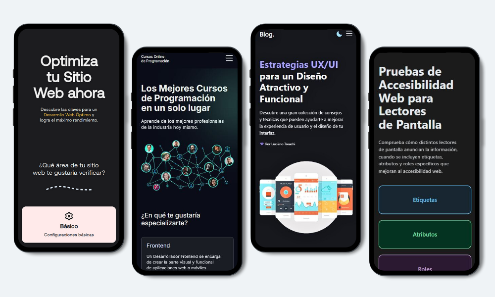

# Luciano Treachi

Soy un **desarrollador frontend** dedicado a crear soluciones web eficientes, accesibles, intuitivas y fáciles de usar que potencian la experiencia del usuario y cumplen con altos estándares de calidad.

## Habilidades técnicas

 **HTML:** Estructuro el contenido web de manera semántica.

 **CSS:** Diseño para distintas resoluciones de pantalla.

 **JavaScript:** Agrego interacción y funcionalidad dinámica.

 **React:** Desarrollo interfaces modulares y reutilizables.

 **Next.js:** Desarrollo aplicaciones modernas con renderizado en el cliente (CSR) y el servidor (SSR).

 **W3C Standards:** Cumplo con los estándares web oficiales.

 **Accesibilidad Web:** Implemento las pautas WCAG para asegurar una mayor inclusividad.

## Proyectos destacados

### Optimizador Web

Sitio web con listas de verificación, herramientas online y extensiones útiles, diseñado para ayudar a los desarrolladores a cumplir con los más altos estándares en UX/UI, velocidad, accesibilidad y buenas prácticas.

🔗 Ver proyecto: [Optimizador Web](https://optimizadorweb.site/)

### Cursos online de programación

Plataforma que reúne los mejores cursos online de programación, clasificados por Frontend, Backend y Aplicaciones Móviles, para facilitar el aprendizaje a profesionales y principiantes.

🔗 Ver proyecto: [Cursos de Programación](https://cursosonlinedeprogramacion.vercel.app/)

### Blog UX/UI

Blog con consejos y estrategias para mejorar la experiencia de usuario en sitios web, creando interfaces más intuitivas y efectivas.

🔗 Ver proyecto: [Blog UX/UI](https://bloguxui.vercel.app/)

### Pruebas Accesibles

Sitio web diseñado para evaluar cómo distintos lectores de pantalla anuncian la información, cuando se incluyen etiquetas, atributos y roles específicos que mejoran la accesibilidad web.

🔗 Ver proyecto: [Pruebas Accesibles](https://pruebasaccesibles.vercel.app/)

## Enlaces importantes

### Sitio web personal

Visita mi sitio web personal para descubrir sobre mi enfoque en el desarrollo frontend y explorar más proyectos.

[https://lucianotreachi.website/](https://lucianotreachi.website/)

### LinkedIn

Conéctate conmigo para discutir colaboraciones o nuevas oportunidades.

[https://www.linkedin.com/in/luciano-treachi/](https://www.linkedin.com/in/luciano-treachi/)
