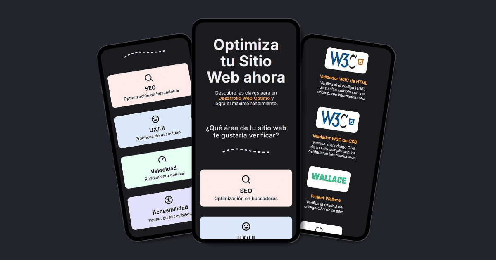
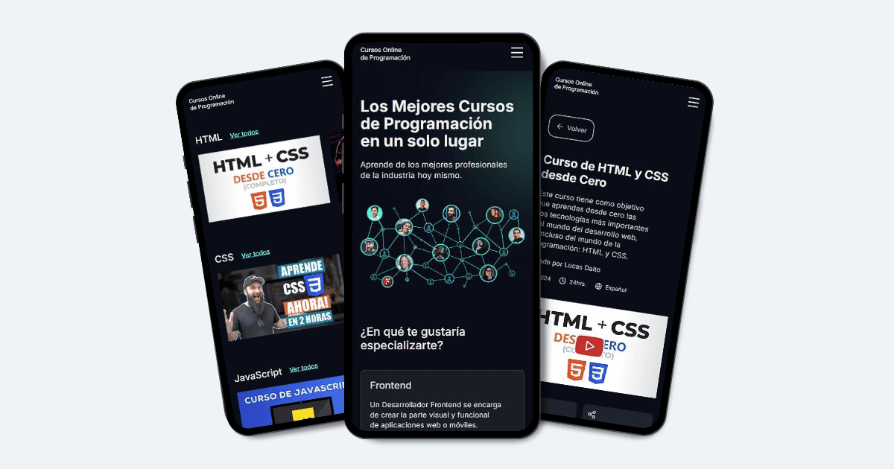
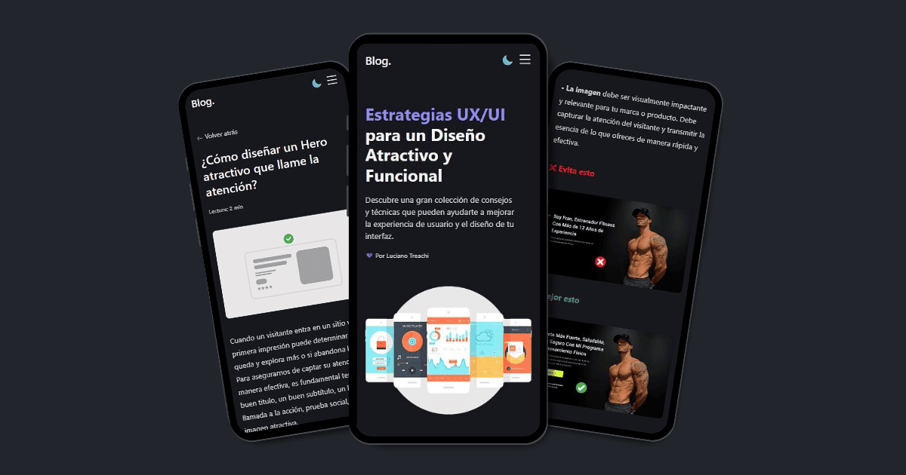
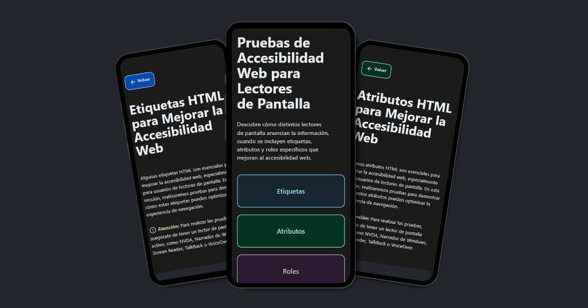

# Luciano Treachi

Soy un **desarrollador frontend** dedicado a crear soluciones web eficientes, accesibles, intuitivas y fáciles de usar que potencian la experiencia del usuario y cumplen con altos estándares de calidad.

## Proyectos destacados

### 🌐 Optimizador Web

Sitio web con listas de verificación, herramientas online y extensiones útiles, diseñado para ayudar a los desarrolladores a cumplir con los más altos estándares en SEO, UX/UI, Rendimiento y Accesibilidad.

↪︎ Ver proyecto: [Optimizador Web](https://optimizadorweb.site/)

### 🌐 Cursos online de programación

Sitio web que reúne los mejores cursos online de programación, clasificados por Frontend, Backend y Aplicaciones Móviles, para facilitar el aprendizaje a profesionales y principiantes.

↪︎ Ver proyecto: [Cursos de Programación](https://cursosonlinedeprogramacion.vercel.app/)

### 🌐 Blog UX/UI

Blog con estrategias y consejos prácticos para diseñar interfaces intuitivas y mejorar la experiencia del usuario en la web.

↪︎ Ver proyecto: [Blog UX/UI](https://bloguxui.vercel.app/)

### 🌐 Pruebas Accesibles

Sitio web diseñado para evaluar cómo distintos lectores de pantalla anuncian la información, cuando se incluyen etiquetas, atributos y roles específicos que mejoran la accesibilidad web.

↪︎ Ver proyecto: [Pruebas Accesibles](https://pruebasaccesibles.vercel.app/)

## Mi Sitio Web Personal

Visita mi sitio web personal para descubrir sobre mi enfoque en el desarrollo frontend y explorar más proyectos.

🔗 [lucianotreachi.website](https://lucianotreachi.website/)

## LinkedIn

Conéctate conmigo para discutir colaboraciones o nuevas oportunidades.

🔗 [linkedin/luciano-treachi](https://www.linkedin.com/in/luciano-treachi/)
