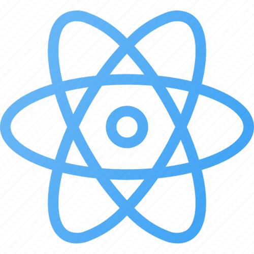

  

## Sitio Web

> [https://lucianotreachi.vercel.app/](https://lucianotreachi.vercel.app//)

## LinkedIn

> [https://www.linkedin.com/LucianoTreachi](https://www.linkedin.com/in/luciano-treachi/)

## Habilidades

 
  &#xa0;
  &#xa0;
  &#xa0; 
  &#xa0; 
  &#xa0; 

